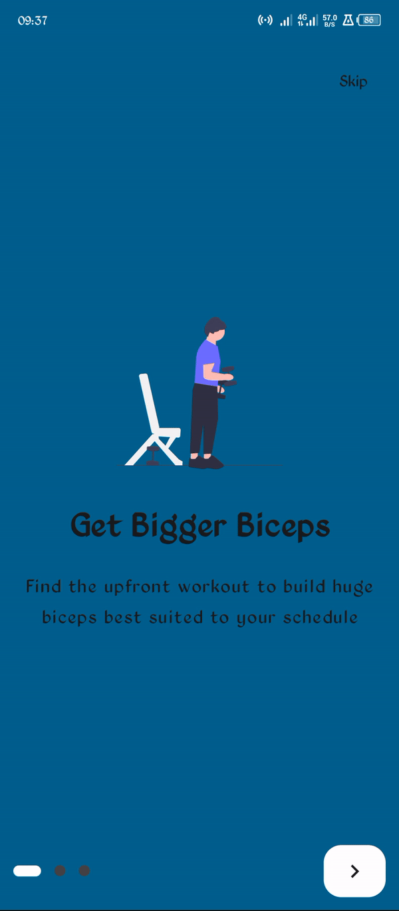

  <h1>OnBoarding UI</h1>
  <h3>Simple OnBoarding Screen design using jetpack compose</h3>

  
  

  Developed with ❤︎ by<h4><a href="https://github.com/isaacjadrey">Isaac Jadrey</a> 
  
  in Kotlin & Jetpack Compose</h4>

## Demo:

